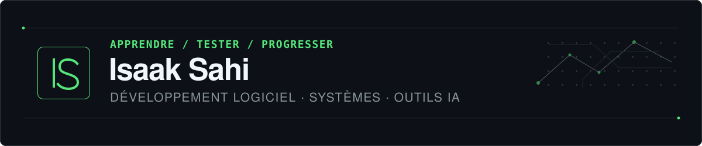

  

  <a href="https://x.com/isaacpolignac">X</a>
  &nbsp;·&nbsp;
  <a href="https://www.linkedin.com/in/isaac-polignac-683948430/">LinkedIn</a>
  &nbsp;·&nbsp;
  <a href="https://www.instagram.com/isaacpolignac">Instagram</a>
  &nbsp;·&nbsp;
  <a href="https://www.tiktok.com/@isaacpolignac">TikTok</a>

---

# About

I'm a 20-year-old builder exploring the intersection of **AI, software, systems, business and e-commerce**.

I'm extremely curious by nature. A large part of my time goes into researching, testing ideas, reading documentation, experimenting with new tools and trying to understand how systems actually work beneath the surface.

I have ADHD. When something catches my attention, I can go very deep into it — sometimes spending hours following research rabbit holes, testing things and connecting ideas between completely different subjects.

I'm also actively learning business. I'm interested in how product, technology, distribution, marketing, operations and infrastructure interact rather than treating them as isolated disciplines.

I don't pretend to be an expert in everything I explore. I'm learning in public, building in public and improving through execution.

> **Always learning. Always researching. Always building.**

## Currently building

### Stealth software project

I'm currently working on my most ambitious project yet.

It's a software platform at the intersection of **AI, creation and digital products**.

I'm deliberately keeping the core architecture, product mechanics and differentiating ideas private for now.

The broader ambition is:

> **Rethink how people go from an idea to something real.**

I believe there is a large opportunity to improve the way people build, launch and evolve digital products.

I'm still early.

More when it's ready.

## What I'm exploring

| Area | What I'm interested in |
| --- | --- |
| **AI** | LLMs, agents, orchestration and AI-native product experiences |
| **Software** | Products, interfaces, developer tools and architecture |
| **Systems** | Automation, workflows, infrastructure and scalable operations |
| **Business** | Strategy, distribution, growth, operations and business models |
| **E-commerce** | Learning acquisition, branding, conversion, logistics and customer behavior through real projects |
| **Product** | Turning unclear ideas into things people actually want |

## How I learn

→ I question almost everything. 
→ I research before forming strong opinions. 
→ I learn fastest by building real things. 
→ I regularly disappear into research rabbit holes. 
→ I document what I learn. 
→ I constantly test new technologies and workflows. 
→ I try to understand systems, not just individual tools. 
→ I connect ideas from different fields. 
→ Curiosity is probably my strongest advantage.

## Current toolkit

### Models

`ChatGPT` · `Claude` · `Gemini`

### Agents & automation

`Hermes Agent` · `AI agents` · `n8n`

### Building

`Codex` · `Claude Code` · `GitHub` · `VS Code`

### Infrastructure

`Linux` · `VPS` · `Docker` · `Cloudflare`

## Learning business

I'm deliberately learning business by studying companies, products, distribution, marketing, unit economics, operations and customer behavior. Building real projects gives me a way to test those ideas instead of only reading about them. I'm especially interested in the connection between technology and distribution.

## Principles

> Build things people actually want. 
> Understand the system, not just the interface. 
> Automate what shouldn't require repetitive human work. 
> Distribution matters. 
> Stay curious. 
> Ship, learn, improve.

## Things I care about

- AI as leverage rather than a gimmick
- Products people genuinely want
- Systems that remove unnecessary complexity
- Distribution
- Great user experiences
- Automation
- Long-term thinking
- Learning through execution
- Difficult and unconventional problems

## Open to meeting

I'm always interested in meeting **founders, engineers, designers, researchers, operators, investors and deeply curious people**.

I especially enjoy talking to people building ambitious products, experimenting with new technologies or thinking differently about how things should work.

If you're working on something interesting, feel free to reach out.

  <strong>Let's build something that matters.</strong>

  <a href="https://x.com/isaacpolignac">X</a>
  &nbsp;·&nbsp;
  <a href="https://www.linkedin.com/in/isaac-polignac-683948430/">LinkedIn</a>
  &nbsp;·&nbsp;
  <a href="https://www.instagram.com/isaacpolignac">Instagram</a>
  &nbsp;·&nbsp;
  <a href="https://www.tiktok.com/@isaacpolignac">TikTok</a>

